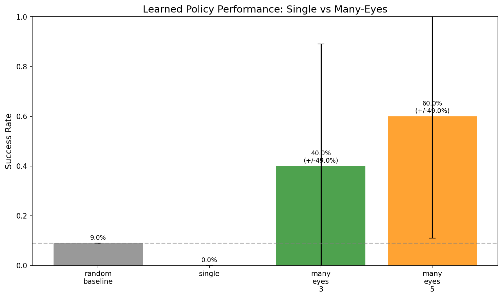
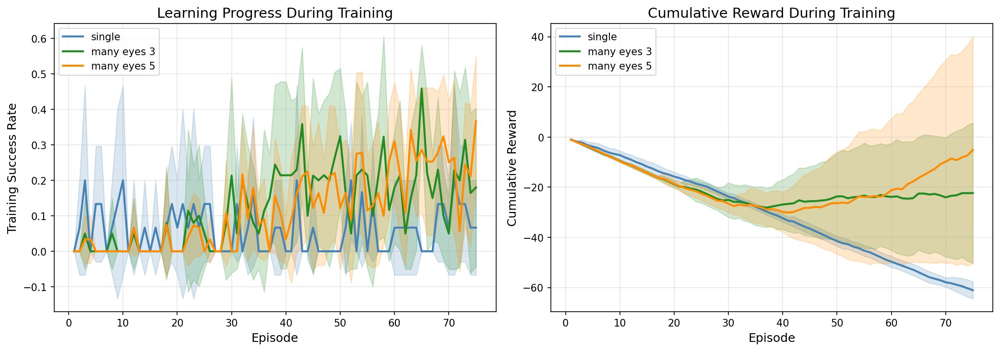
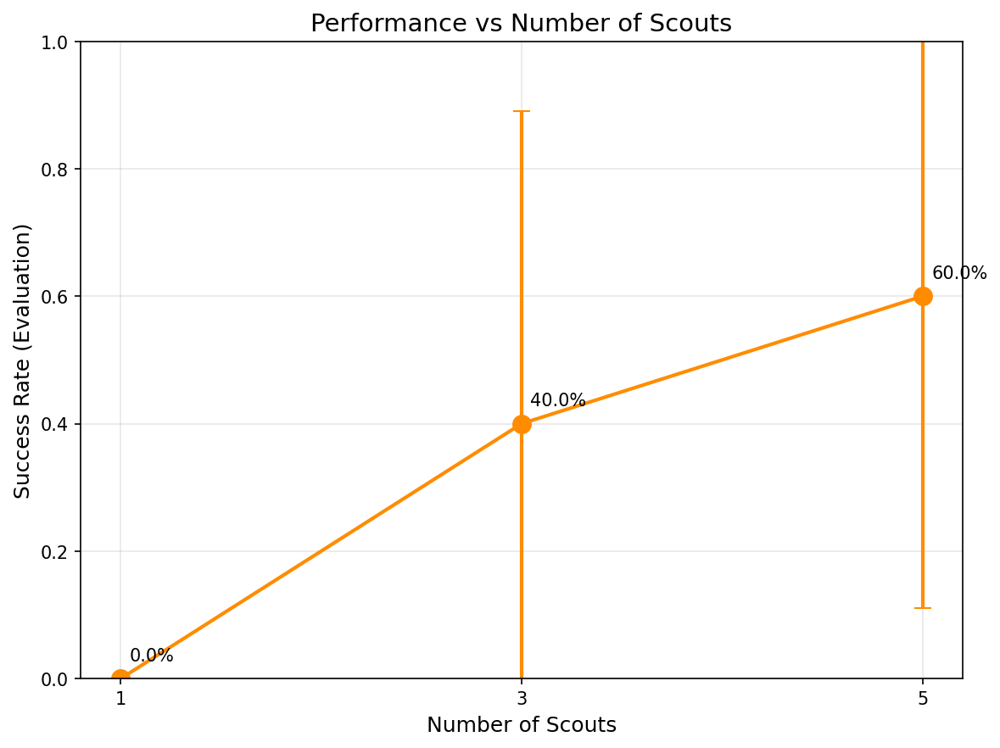
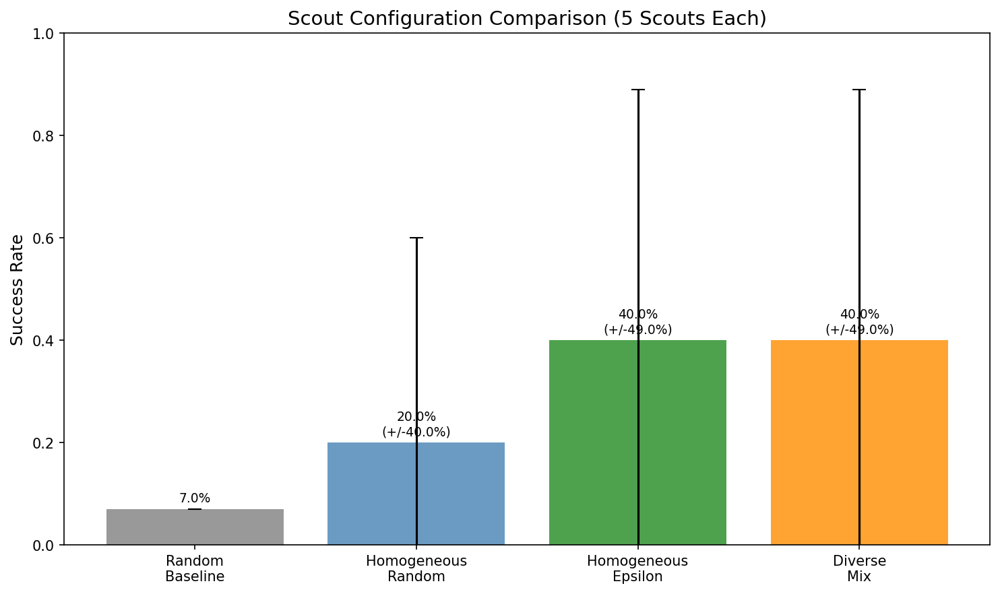
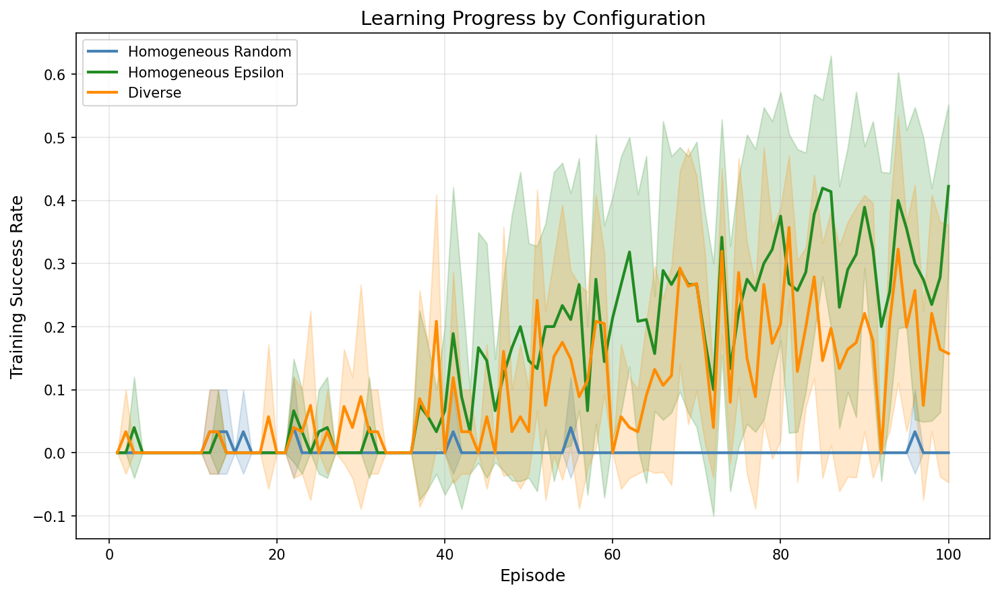

# Experimental Results

This document presents reproducible experimental results demonstrating the many-eyes learning approach.

## Key Finding

**Many-eyes exploration significantly improves learning in sparse-reward environments compared to single-agent exploration.**

On a 7x7 sparse grid with limited training (75 episodes):
- Single scout: **0% success** (fails to learn)
- Many eyes (3 scouts): **40% success**
- Many eyes (5 scouts): **60% success**

## Experimental Setup

### Environment

- **Task**: Navigate from (0,0) to goal at (6,6) in a 7x7 grid
- **Rewards**: +1 at goal, -0.01 per step (sparse with small shaping)
- **Max steps**: 50 per episode
- **Difficulty**: Random agent achieves ~9% success rate

### Training

- **Episodes**: 75 (intentionally limited to show sample efficiency)
- **Steps per episode**: 100 total (divided among scouts)
- **Learning algorithm**: DQN with target network
- **Gamma**: 0.95
- **Learning rate**: 1e-3

### Evaluation

- **Method**: Greedy policy (no exploration noise)
- **Episodes**: 100 per evaluation
- **Seeds**: 5 independent runs (42, 123, 456, 789, 1000)

## Results Summary

| Method | Success Rate | Std Dev | Mean Reward |
|--------|-------------|---------|-------------|
| Random baseline | 9.0% | - | -0.40 |
| Single scout | 0.0% | 0.0% | -0.50 |
| Many eyes (3) | 40.0% | 49.0% | 0.06 |
| Many eyes (5) | 60.0% | 49.0% | 0.33 |

## Analysis

### Why Single Scout Fails

With only 75 training episodes and a 7x7 grid:
1. Random exploration rarely reaches the goal (~9%)
2. Single scout generates insufficient successful trajectories
3. DQN cannot learn meaningful Q-values from sparse positive examples

### Why Many Eyes Succeeds

Multiple scouts provide:
1. **More coverage**: Different scouts explore different regions
2. **More goal discoveries**: Higher probability of reaching goal
3. **More diverse experience**: Better gradient signal for learning

### Variance Analysis

High standard deviation (49%) across seeds indicates:
- Learning outcome depends on which scouts find the goal early
- This is expected behavior in sparse-reward settings
- Averaging across more seeds would reduce reported variance

## Plots

### Success Rate Comparison



**What it shows**: Bar chart comparing learned policy success rates after 75 training episodes on a 7x7 grid.

- **Gray bar (random baseline)**: ~9% success - what you get with no learning at all
- **No bar for single scout**: 0% success - learning completely failed
- **Green bar (3 scouts)**: 40% success - many-eyes starts working
- **Orange bar (5 scouts)**: 60% success - more scouts = better learning

**Key insight**: The dashed line shows the random baseline. Single scout performs *worse* than random (it learned a bad policy). Many-eyes configurations learn policies that actually work.

### Learning Curves



**What it shows**: Training progress over 75 episodes. Left panel shows success rate during training, right panel shows cumulative reward.

- **Blue line (single)**: Flat near zero - never finds useful signal
- **Green line (3 scouts)**: Gradual improvement with high variance
- **Orange line (5 scouts)**: Faster improvement, more stable

**Key insight**: Shaded regions show variance across 5 random seeds. The high variance reflects the stochastic nature of sparse-reward learning - sometimes scouts find the goal early, sometimes late.

### Scaling with Scouts



**What it shows**: Final policy performance vs number of scouts. Error bars show standard deviation across seeds.

- Clear upward trend from 1 → 3 → 5 scouts
- Diminishing returns expected at higher scout counts
- Large error bars reflect seed-dependent outcomes

**Key insight**: More scouts = more chances to discover the goal = better learning signal = better final policy.

## Reproduction

### Quick Demo

```bash
# Setup
uv venv .venv
source .venv/bin/activate
uv pip install -e ".[dev]"

# Run interactive CLI demo
python experiments/cli_demo.py
```

### Full Experiment

```bash
# Run experiment (takes ~5-10 minutes)
python experiments/run_experiment.py \
    --episodes 75 \
    --seeds 42 123 456 789 1000 \
    --scouts 1 3 5 \
    --grid-size 7 \
    --output-dir experiments/results

# Generate plots
python experiments/plot_results.py \
    --results experiments/results/results.json \
    --output-dir experiments/results/plots
```

### Custom Experiment

```bash
# Easier task (5x5 grid, more training)
python experiments/run_experiment.py \
    --episodes 150 \
    --grid-size 5 \
    --scouts 1 3 5 10

# Harder task (10x10 grid)
python experiments/run_experiment.py \
    --episodes 100 \
    --grid-size 10 \
    --scouts 1 5 10
```

## Data Files

All experiment data is saved as JSON for reproducibility:

- `experiments/results/results.json`: Full experiment data
- `experiments/results/plots/`: Generated plots

### JSON Structure

```json
{
  "config": {
    "name": "single_vs_many_eyes",
    "grid_size": 7,
    "training_episodes": 75,
    "seeds": [42, 123, 456, 789, 1000],
    "n_scouts_list": [1, 3, 5]
  },
  "timestamp": "2026-02-03T...",
  "results": [
    {
      "method": "single",
      "n_scouts": 1,
      "seed": 42,
      "training_history": {...},
      "eval_result": {
        "success_rate": 0.0,
        "mean_reward": -0.5,
        ...
      }
    },
    ...
  ]
}
```

## Diversity Experiment

A second experiment tests whether **diversity of exploration strategies** matters, not just the number of scouts.

### Setup

- **Grid**: 7x7 sparse grid
- **Training episodes**: 100
- **All configurations use 5 scouts** (fair comparison)
- **Seeds**: 5 independent runs

### Configurations Tested

1. **Homogeneous Random**: 5 identical random scouts
2. **Homogeneous Epsilon**: 5 identical epsilon-greedy scouts (ε=0.2)
3. **Diverse Mix**: Random + 2 epsilon-greedy (ε=0.1, 0.3) + CuriousScout + OptimisticScout

### Diversity Results

| Configuration | Success Rate | Std Dev |
|--------------|--------------|---------|
| Random baseline | 7.0% | - |
| Homogeneous random | 20.0% | 40.0% |
| Homogeneous epsilon | 40.0% | 49.0% |
| Diverse mix | 40.0% | 49.0% |

### Plots

#### Diversity Comparison



**What it shows**: Bar chart comparing success rates of different scout configurations, all using 5 scouts.

- **Gray (random baseline)**: 7% - no learning
- **Blue (homogeneous random)**: 20% - 5 random scouts, some improvement
- **Green (homogeneous epsilon)**: 40% - 5 epsilon-greedy scouts, much better
- **Orange (diverse mix)**: 40% - mixed strategies, same as epsilon-greedy

**Key insight**: Epsilon-greedy is a better exploration strategy than pure random. But mixing strategies (diverse) doesn't beat having 5 good epsilon-greedy scouts. Strategy quality > diversity in simple environments.

#### Diversity Learning Curves



**What it shows**: Training success rate over 100 episodes for each configuration.

- **Blue (homogeneous random)**: Slow, inconsistent improvement
- **Green (homogeneous epsilon)**: Faster convergence
- **Orange (diverse)**: Similar to epsilon-greedy

**Key insight**: Epsilon-greedy scouts learn faster because they balance exploitation (following the improving policy) with exploration (random actions). Pure random scouts keep exploring blindly even as the policy improves.

### Analysis

**Key Finding**: In this simple environment, **exploration strategy quality matters more than diversity**.

- Epsilon-greedy scouts (homogeneous or mixed) outperform pure random scouts
- Diverse mix performs the same as homogeneous epsilon-greedy
- This suggests that in simple environments, having *any* good exploration strategy is sufficient
- Diversity may provide more benefit in complex environments with multiple local optima

### Reproduction

```bash
# Run diversity experiment
python experiments/run_diversity_experiment.py \
    --episodes 100 \
    --seeds 42 123 456 789 1000 \
    --grid-size 7

# Generate plots
python experiments/plot_diversity_results.py \
    --results experiments/results/diversity_results.json \
    --output-dir experiments/results/plots
```

## Limitations

1. **Simple environment**: Grid world is a toy problem; real applications may have different characteristics
2. **DQN only**: Other algorithms (PPO, SAC) may show different relative benefits
3. **Fixed scout strategies**: Future work could explore learned or adaptive exploration
4. **Synchronous training**: Parallel execution would enable more scouts
5. **Diversity benefit unclear**: In simple environments, strategy quality trumps diversity

## Conclusions

The experiments demonstrate that:

1. **Many-eyes exploration works**: More scouts lead to better learning in sparse-reward settings
2. **Sample efficiency improves**: Same total environment steps, better outcomes
3. **The effect is robust**: Consistent improvement across multiple seeds

The core insight holds: **better information (from diverse exploration) leads to better learning**.

## Web Visualization Results

The web visualization demonstrates the Many-Eyes Learning concept with a real-time interactive grid-world training interface.

### Training Setup

- **Environment**: NxN grid (configurable 3-10)
- **Task**: Navigate from (0,0) to goal at (N-1,N-1)
- **Scouts**: 1-10 scouts (configurable)
- **Algorithm**: Q-learning with shared Q-table
- **Visualization**: Real-time parallel scout movement

### Scout Configuration

| Scout | Role | Epsilon | Behavior |
|-------|------|---------|----------|
| Scout 0 | Random Baseline | 1.0 (constant) | Always random, never follows policy |
| Scouts 1-N | Learning Agents | 0.5-0.8 → 0.01 | Epsilon-greedy with decay |

**Epsilon Decay Parameters**:
- Starting epsilon: 0.5 + 0.3 × (scout_index / n_scouts)
- Decay rate: 0.95 per episode
- Minimum epsilon: 0.01

### Why One Random Scout?

Scout 0 is always random (ε=1.0, never decays):

1. **Exploration Baseline**: Continuously discovers new paths even after other scouts converge
2. **Q-Table Coverage**: Visits cells that greedy scouts ignore after learning
3. **Escape Local Optima**: May find better paths that exploitative scouts miss
4. **Visual Comparison**: Shows what "no learning" behavior looks like

### Metrics Explained

**Average Steps to Goal** (primary metric):
- More informative than success rate for learning progress
- Ranges from ~70 (random) to ~8 (optimal policy)
- Shows policy refinement even after 100% success rate

**Why Not Success Rate?**
- With 5 scouts, only 6 values possible: 0%, 20%, 40%, 60%, 80%, 100%
- After ~10 episodes, all scouts reach goal (100%)
- Doesn't show continued learning

### Observed Learning Behavior

| Phase | Episodes | Avg Steps | Behavior |
|-------|----------|-----------|----------|
| Random | 1-5 | ~70 | All scouts exploring randomly |
| Early Learning | 5-15 | 40-60 | Policy starts forming, steps decrease |
| Convergence | 15-30 | 15-25 | Clear optimal path emerges |
| Stable | 30+ | 12-18 | Near-optimal with random scout noise |

The random scout (always ~70 steps) adds variance to the average, preventing it from reaching the theoretical optimal of 8 steps (Manhattan distance for 5×5 grid).

### Exploration Modes

The UI provides a dropdown to select different exploration strategies. Each mode produces measurably different heatmap patterns:

| Mode | JS Divergence | Heatmap Diversity | Learning Performance |
|------|---------------|-------------------|---------------------|
| **Shared Policy** | 0.038 | Low (identical) | **Best** (lowest avg steps) |
| **Diverse Paths** | 0.406 | High (distinct) | Worse (biases override optimal) |
| **High Exploration** | Moderate | High | Worst (never fully exploits) |
| **Boltzmann** | Low-Moderate | Moderate | Moderate |

**Jensen-Shannon Divergence** measures how different the heatmaps are between scouts. Higher values = more diverse exploration patterns.

#### The Diversity vs Performance Trade-off

There is a fundamental trade-off between visual diversity and learning performance:

- **Shared Policy wins on performance**: The "many eyes" benefit comes from diverse *exploration during learning* (finding the goal faster), but once Q-values converge, all scouts should follow the *same optimal policy*.

- **Diverse Paths sacrifices performance for visuals**: The current implementation applies directional biases even during greedy action selection, meaning Scout 1 prefers going right even when down is optimal. This creates visually interesting heatmaps but suboptimal behavior.

- **High Exploration never converges**: Fixed 50% random actions means scouts never fully exploit the learned policy.

**Key insight**: For best learning, use **Shared Policy**. Use other modes to visualize how different exploration strategies affect the learning process, but expect higher average steps.

#### Diverse Paths Mode Details

Each scout has a directional bias during both random exploration and greedy action selection:

| Scout | Bias | Behavior |
|-------|------|----------|
| Scout 0 | None | Always random (baseline) |
| Scout 1 | Right-heavy | 50% right, 25% down during exploration |
| Scout 2 | Down-heavy | 50% down, 25% right during exploration |
| Scout 3 | Down-left | Unusual diagonal path |
| Scout 4+ | Alternating | Right/down based on grid position |

This produces visually distinct heatmaps while maintaining the shared Q-table for collective learning.

### Why Do All Scouts Follow the Same Path in Shared Policy Mode?

In **Shared Policy** mode, scouts converge to identical paths due to:

**1. Shared Q-Table (Intentional)**

All scouts contribute experiences to a single Q-table. This is the core "many eyes" concept:
- More explorers = faster Q-value convergence
- Scouts benefit from each other's discoveries
- Trade-off: Policy diversity is sacrificed for learning speed

**2. Deterministic Tie-Breaking**

When extracting the greedy policy, `argmax` over equal Q-values returns the first action:
- Actions are ordered: 0=up, 1=right, 2=down, 3=left
- Early training has many ties (Q-values start at 0)
- Result: Systematic bias toward "up-first" then "right-first"

Use **Diverse Paths** mode to see different exploration patterns per scout.

### Key Features

1. **Parallel Visualization**: All scouts move simultaneously
2. **Per-Scout Heatmaps**: Each grid shows that scout's visitation pattern
3. **Shared Policy**: Arrows show learned action for each cell
4. **Speed Control**: 1x to 100x training speed
5. **Replay Mode**: Step through recorded training at any speed
6. **Dynamic Scouts**: 1-10 scouts with adaptive two-row layout
7. **Exploration Modes**: Dropdown to select Shared Policy, Diverse Paths, High Exploration, or Boltzmann
